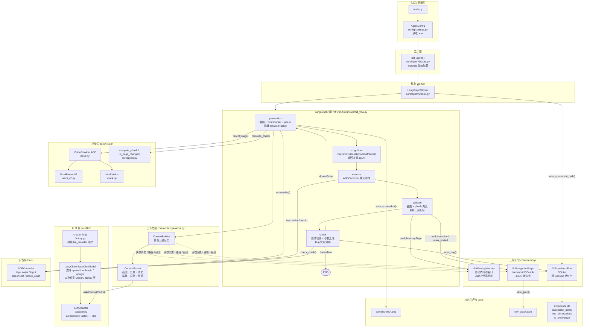

# AutoTestAgent

基于 **LangGraph + VLM + OmniParser V2** 的游戏自动化测试 Agent。

采用「工厂模式 + 抽象基类」设计，Vision / Brain 层均可通过配置文件一键切换，无需改动核心流程代码。

---

## 目录结构

```
AutoTestAgent/
├── main.py                        # 入口
├── requirements.txt               # Python 依赖
├── run.bat                        # Windows 一键启动（自动安装+运行）
├── setup.bat                      # Windows 一键安装脚本
├── setup.sh                       # Linux/macOS 一键安装脚本
├── .env.example                   # 配置模板（复制为 .env 填写）
├── .gitignore
│
├── config/
│   ├── settings.py                # AgentConfig 数据类 + load_config()
│   └── prompt_template.json       # 系统提示词模板（与代码解耦）
│
├── core/                          # 核心业务逻辑（唯一代码存放地）
│   ├── llm/                       # LLM 抽象层（LangChain 接口）
│   │   ├── factory.py             # create_llm() — 根据 LLM_PROVIDER 实例化
│   │   └── adapter.py             # LLMAdapter — ask(ContextPacket) → dict
│   ├── vision/
│   │   ├── base.py                # VisionProvider 抽象基类
│   │   ├── perception.py          # compute_phash / is_page_changed
│   │   └── providers/
│   │       ├── omni_v2.py         # OmniParser V2（默认）
│   │       └── mock.py            # Mock，用于调试 / CI
│   ├── memory/                    # 三层记忆（实际代码在此）
│   │   ├── working_memory.py      # 第一层：短期工作记忆
│   │   ├── nav_graph.py           # 第二层：导航图（NetworkX）
│   │   └── experience_pool.py     # 第三层：经验池（SQLite）
│   ├── context/
│   │   └── protocol.py            # ContextPacket + ContextBuilder
│   ├── agent/
│   │   ├── factory.py             # get_agent(config)
│   │   └── worker.py              # LangGraphWorker
│
├── workflows/
│   ├── waterfall_flow.py          # LangGraph 5 节点瀑布流
│   └── recovery_flow.py           # 冻结 / 崩溃恢复子图
│
├── tests/
│   ├── test_memory.py             # 三层记忆单元测试
│   └── test_llm_adapter.py        # LLMAdapter 单元测试
│
├── data/                          # 运行时产物（gitignored）
│   ├── screenshots/               # 步骤截图
│   └── logs/                      # experience.db + nav_graph.json
│
├── models/                        # 本地模型服务（按模型分子目录）
│   └── omni/                      # OmniParser V2（安装+启动）
│       ├── omniparser.py          # 安装+启动一体化脚本
│       ├── omniparser.bat         # Windows 启动器
│       ├── omniparser.sh          # Linux/Mac 启动器
│       ├── OmniParser/            # git clone（gitignored）
│       └── weights/               # 模型权重（gitignored）
│
└── tools/                         # ADB 工具层
    ├── adb_controller.py
    ├── adb_setup.py
    ├── core.py
    └── utils.py
```

---

## 系统架构图



---

## 快速开始

### 1. 一键安装

**Windows**
```bat
setup.bat
```

**Linux / macOS**
```bash
bash setup.sh
```

> 脚本会自动：创建 `.venv` → 安装依赖 → 复制 `.env.example` → 创建 `data/` 目录。

### 2. 配置 .env

```bash
# 编辑 .env，至少填写以下两项：
LLM_API_KEY=sk-your-key
GAME_PACKAGE=com.your.game
```

### 3. 启动 OmniParser V2

```bat
# Windows（首次自动安装，后续直接启动）
models\omni\omniparser.bat
```
```bash
# Linux/Mac
bash models/omni/omniparser.sh
# 服务地址: http://127.0.0.1:7861
```

### 4. 运行测试

**Windows（推荐）**
```bat
run.bat                                  # 交互式输入任务
run.bat --task "进入设置并开启夜间模式"  # 直接传参
run.bat --task "测试登录" --vision mock  # Mock 视觉快速调试
```

**直接调用 Python**
```bash
python main.py --task "进入设置并开启夜间模式"
python main.py --task "测试登录流程" --vision mock
python main.py --task "测试登录流程" --llm-provider anthropic
```

### 5. 运行单元测试

```bash
pytest tests/ -v
```

---

## 扩展指南

### 新增视觉 Provider

1. 在 `core/vision/providers/` 下创建文件，例如 `paddle_ocr.py`
2. 定义 `Provider(VisionProvider)` 类并实现 `detect(image)` 方法
3. 在 `.env` 中设置 `VISION_TYPE=paddle_ocr`，无需改其他代码

### 新增 LLM Provider

LLM 层由 LangChain `BaseChatModel` 统一抽象，切换模型不需改任何业务代码：

**方法一：已支持的 provider，仅改 `.env`**
```ini
# 切换到 Claude
LLM_PROVIDER=anthropic
LLM_MODEL=claude-3-5-sonnet-20241022
# pip install langchain-anthropic

# 切换到 Gemini
LLM_PROVIDER=google
LLM_MODEL=gemini-1.5-pro
# pip install langchain-google-genai

# 切换到本地 Ollama
LLM_PROVIDER=openai
LLM_API_KEY=dummy
LLM_API_BASE=http://localhost:11434/v1
LLM_MODEL=llava:13b
```

**方法二：接入尚未支持的新 provider**
1. 在 `core/llm/factory.py` 的 `_MAKERS` 中添加一个 `_make_<provider>` 函数
2. 在 `.env` 中设置 `LLM_PROVIDER=<provider>`
3. 按需安装对应的 `langchain-<provider>` 包

---

## LangGraph 执行流

```
perception → cognition → execute → validate → check
    ↑                                              │
    └──────────────────────────────────────────────┘
                    (done=False 时循环)
```

| 节点       | 职责                                                         |
|------------|--------------------------------------------------------------|
| perception | ADB 截图 + OmniParser 检测 + phash 计算 + ContextPacket 构建 |
| cognition  | LLMAdapter.ask(ContextPacket) → 动作决策 JSON（通过 LangChain）  |
| execute    | ADBController 执行 tap/swipe/input/press_back 等动作         |
| validate   | 执行后再截图，比较 phash，更新三层记忆                        |
| check      | 崩溃检测 + 步数上限检查 + Bug 快照保存                       |

## 三层记忆系统

| 层级 | 模块 | 存储 | 职责 |
|------|------|------|------|
| 第一层 | `WorkingMemory` | 进程内 | 最近 N 步操作记录，ABA 循环检测 |
| 第二层 | `NavigationGraph` | NetworkX（可序列化 JSON） | 页面跳转图，元素访问标记，面包屑路径 |
| 第三层 | `ExperiencePool` | SQLite（`data/logs/experience.db`） | 成功路径复用，Bug 快照，UI 知识库 |
